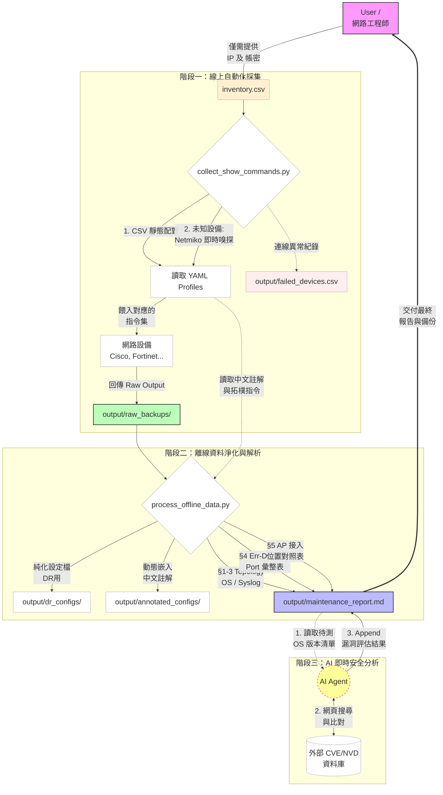

# 🛡️ NetAuto Maintainer — 多廠牌網路設備自動化維護框架

全自動化的網路設備健檢與維護工具，透過 **YAML Profile 驅動**，讓新增設備支援只需一個設定檔。全流程**嚴格唯讀**，絕不修改設備設定。

## ✨ 特色

- **多廠牌支援**：Cisco IOS/NX-OS/WLC、Fortinet，可自行擴充
- **Profile 驅動**：指令集定義為 YAML，新增設備免改程式碼
- **並行化 SSH**：預設 5 條並行緒，大量設備快速採集
- **CVE 即時比對**：AI Agent 線上搜尋最新 CVE，不使用過期靜態資料庫
- **四大產出物**：Raw 備份、DR 設定檔、中文註解版、Mermaid 拓樸報告
- **Err-Disabled 自動偵測**：解析 `show interfaces status err-disabled` + syslog 交叉比對，輸出觸發原因與處置建議
- **AP 接入位置反查**：`show mac address-table` + CDP 多層追蹤，定位每台 AP 的實體 Switch 與 Port（支援 STATIC port-security 條目）

## 🚀 快速開始

```bash
# 1. 安裝相依套件
pip install -r requirements.txt

# 2. 準備設備清單 (格式參照 inventory_template.csv)
cp inventory_template.csv inventory.csv
# 編輯 inventory.csv 填入實際設備資訊

# 3. 線上 SSH 採集
python scripts/collect_show_commands.py -i inventory.csv -o output

# 4. 離線分析
python scripts/process_offline_data.py -r output/raw_backups -o output
```

## 📂 目錄結構

```text
NetAuto_Maintainer/
├── SKILL.md                        ← AI Agent 唯一入口與 SOP 指南
├── README.md                       ← 本文件
├── requirements.txt                ← Python 相依套件
├── inventory_template.csv          ← 設備清單範本 (可留空廠牌以自動嗅探)
├── command_profiles/               ← 設備指令集 Profile (YAML)
│   ├── cisco_ios.yml
│   ├── cisco_nxos.yml
│   ├── cisco_wlc.yml
│   ├── fortinet.yml
│   ├── _template.yml               ← 自訂設備範本
│   └── README.md
├── scripts/
│   ├── collect_show_commands.py    ← SSH 自動嗅探與並行採集
│   └── process_offline_data.py     ← 離線分析、拓樸產出、Err-Disabled 偵測、AP 位置反查
└── examples/                       ← 去識別化的範例產出
    ├── sample_maintenance_report.md           ← Markdown 格式範例
    └── sample_edge_maintenance_report.html    ← A4 HTML 格式範例（含封面、拓樸圖、AP 位置表）
```

## 🔧 新增設備支援

1. 複製 `command_profiles/_template.yml` 為新檔案
2. 填入 Netmiko device_type 與指令集
3. 存入 `command_profiles/` 即可

詳見 [command_profiles/README.md](command_profiles/README.md)。

## 📊 範例與實際輸出

本專案在 `examples/` 目錄下提供兩份去識別化的維護報告，所有真實 IP、MAC 位址與公司資訊均已替換：

| 範例檔案 | 格式 | 說明 |
|----------|------|------|
| [sample_maintenance_report.md](examples/sample_maintenance_report.md) | Markdown | 基本維護報告，含拓樸圖與設備 CVE 狀態表 |
| [**sample_edge_maintenance_report.html**](examples/sample_edge_maintenance_report.html) | **HTML（A4 可列印）** | **完整 6 頁報告**，含封面、Q1/Q2 差異摘要、Err-Disabled Port 彙整表、AP 接入位置對照表（43 台 AP 全定位）；可直接由瀏覽器列印或存為 PDF |

> **HTML 報告轉 PDF**：瀏覽器開啟後 `Ctrl+P` → 印表機選「另存為 PDF」→ A4 直向 → 取消頁首頁尾 → 儲存。
> 或使用 Chrome headless：
> ```bash
> chrome --headless --print-to-pdf=report.pdf sample_edge_maintenance_report.html
> ```

**報告自動產出章節一覽**：

| 章節 | 內容 |
|------|------|
| §1 Core CDP Topology | Mermaid 格式的骨幹拓樸圖，自動過濾 AP 與 IP Phone |
| §2 設備狀態總覽 | OS 版本、DR 純化狀態、異常日誌筆數、CVE 快速評估 |
| §3 Syslog 詳細分析 | 各設備 Error/Critical 事件（Top 5） |
| **§4 Err-Disabled Port 彙整** | 全站被停用的 Port、觸發原因（link-flap / bpduguard / psecure 等）、處置建議 |
| **§5 AP 接入位置對照表** | 每台 AP 所在的 Switch 與 Port（MAC Table 反查，支援 STATIC 條目） |

**實際執行產出**：您執行腳本所產出的報告與備份（含真實 IP 與架構），儲存於您指定的輸出目錄（預設 `output/`）。為保護機敏資料，該目錄已寫入 `.gitignore`，**絕對不會**被加入版本控制。

## 🏛️ 專案流程架構



## ⚠️ 安全須知

- 本工具全流程 **唯讀 (Read-only)**，禁止任何設定變更
- `inventory.csv` 含敏感帳密，**切勿上傳至版本控制**
- 產出的 `raw_backups/` 與 `dr_configs/` 含設備完整設定，請妥善保管

## 📦 相依套件與核心技術 (Dependencies)

本專案致力於降低環境建立門檻，核心技術棧如下：
* **[Netmiko](https://github.com/ktbyers/netmiko)**: 業界標準的跨廠牌 SSH 連線套件。本專案深度整合其 `SSHDetect` 模組，達成全自動的設備廠牌辨識 (Auto-discovery)。
* **[PyYAML](https://pyyaml.org/)**: 用於解析 `command_profiles/`，徹底將 CLI 指令、中文註解邏輯與 Python 腳本解耦。
