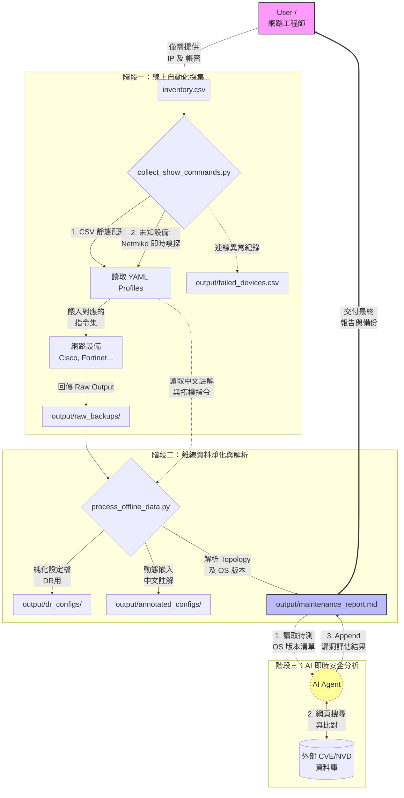

# 🛡️ NetAuto Maintainer — 多廠牌網路設備自動化維護框架

全自動化的網路設備健檢與維護工具，透過 **YAML Profile 驅動**，讓新增設備支援只需一個設定檔。全流程**嚴格唯讀**，絕不修改設備設定。

## ✨ 特色

- **多廠牌支援**：Cisco IOS/NX-OS/WLC、Fortinet，可自行擴充
- **Profile 驅動**：指令集定義為 YAML，新增設備免改程式碼
- **並行化 SSH**：預設 5 條並行緒，大量設備快速採集
- **CVE 即時比對**：AI Agent 線上搜尋最新 CVE，不使用過期靜態資料庫
- **四大產出物**：Raw 備份、DR 設定檔、中文註解版、Mermaid 拓樸報告
- **AP 追蹤**：透過 `show mac address-table` + CDP 交叉比對 AP 接入位置

## 🚀 快速開始

```bash
# 1. 安裝相依套件
pip install -r requirements.txt

# 2. 準備設備清單 (格式參照 inventory_template.csv)
cp inventory_template.csv inventory.csv
# 編輯 inventory.csv 填入實際設備資訊

# 3. 線上 SSH 採集
python scripts/collect_show_commands.py -i inventory.csv -o output

# 4. 離線分析
python scripts/process_offline_data.py -r output/raw_backups -o output
```

## 📂 目錄結構

```text
NetAuto_Maintainer/
├── SKILL.md                        ← AI Agent 唯一入口與 SOP 指南
├── README.md                       ← 本文件
├── requirements.txt                ← Python 相依套件
├── inventory_template.csv          ← 設備清單範本 (可留空廠牌以自動嗅探)
├── command_profiles/               ← 設備指令集 Profile (YAML)
│   ├── cisco_ios.yml
│   ├── cisco_nxos.yml
│   ├── cisco_wlc.yml
│   ├── fortinet.yml
│   ├── _template.yml               ← 自訂設備範本
│   └── README.md
├── scripts/
│   ├── collect_show_commands.py    ← SSH 自動嗅探與並行採集
│   └── process_offline_data.py     ← 離線分析、拓樸產出與動態中文註解
└── examples/                       ← 去識別化的範例產出
    └── sample_maintenance_report.md
```

## 🔧 新增設備支援

1. 複製 `command_profiles/_template.yml` 為新檔案
2. 填入 Netmiko device_type 與指令集
3. 存入 `command_profiles/` 即可

詳見 [command_profiles/README.md](command_profiles/README.md)。

## 📊 範例與實際輸出

*   **公開展示範本**：本專案提供一份[去識別化的維護報告範本 (examples/sample_maintenance_report.md)](examples/sample_maintenance_report.md)，僅供您在公開 Repo 展示本專案的運作成果。
*   **實際執行產出**：您實際執行腳本所產出的報告與備份（包含真實 IP 與架構），會完整儲存於您指定的輸出目錄（預設為 `output/` 目錄）。為保護機敏資料，該目錄已寫入 `.gitignore`，**絕對不會**被加入版本控制。

## 🏛️ 專案流程架構



## ⚠️ 安全須知

- 本工具全流程 **唯讀 (Read-only)**，禁止任何設定變更
- `inventory.csv` 含敏感帳密，**切勿上傳至版本控制**
- 產出的 `raw_backups/` 與 `dr_configs/` 含設備完整設定，請妥善保管

## 📦 相依套件與核心技術 (Dependencies)

本專案致力於降低環境建立門檻，核心技術棧如下：
* **[Netmiko](https://github.com/ktbyers/netmiko)**: 業界標準的跨廠牌 SSH 連線套件。本專案深度整合其 `SSHDetect` 模組，達成全自動的設備廠牌辨識 (Auto-discovery)。
* **[PyYAML](https://pyyaml.org/)**: 用於解析 `command_profiles/`，徹底將 CLI 指令、中文註解邏輯與 Python 腳本解耦。
