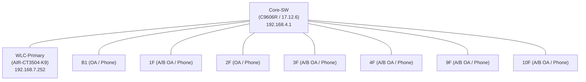

# ACME Corp 2026 Q2 網路設備定期維護報告

**分析時間**: 2026/04/27 10:29
**上次維護時間**: 2026/03/30 (Q1)
**維護範圍**：Core Switch × 1、Edge Switch × 24、WLC × 1（共 26 台）

---
## 📁 隨附設定檔與備份路徑說明

*   **災難還原設定檔目錄 (`.\dr_configs\`)**：已剔除雜訊的純配置指令檔，可 100% 回貼空機。
*   **原始狀態除錯備份目錄 (`.\raw_backups\`)**：含全方位狀態原始輸出，專供工程師深度 Debug。
*   **帶註解的完整備份目錄 (`.\annotated_configs\`)**：為 raw 的中文註解版，便於交接。
---

## 1. 與上季 (Q1) 關鍵差異摘要

### ✅ 正面改善

| 項目 | Q1 (2026/03/30) | Q2 (2026/04/27) | 說明 |
|------|-----------------|-----------------|------|
| **Core-SW** (192.168.4.1) 韌體 | IOS XE **16.12.4** | IOS XE **17.12.6** | 已完成升級，消除 EoL 漏洞 |
| Core-SW CVE 狀態 | ⚠️ 2 項 EoL CVE | ✅ 未發現已知重大 CVE | 升級成效確認 |

### ⚠️ 新增異常

| 設備 | 事件 | 嚴重性 | 建議處置 |
|------|------|--------|----------|
| **9F-A-OA** (192.168.91.253) | `%PM-4-ERR_DISABLE: link-flap error detected on Gi3/0/17` — port 已被自動停用 | 中 | 現場檢查 Gi3/0/17 連接的線路或對端設備 |

### 🔄 持續風險（未變動）

| 設備 | OS Version | CVE 風險 |
|------|-----------|----------|
| **WLC-Primary** (192.168.7.252) | AireOS **8.8.120.0** | [EoL] CVE-2020-3453, CVE-2021-1469 |

---

## 2. 網路核心接線架構圖 (Core CDP Topology)
*(註：已自動過濾 IP Phones 與微型 AP)*

## 3. 設備狀態總覽與 CVE 漏洞評估表
| Hostname | IP | OS Version | DR純化 | 異常日誌 | 已知 CVE |
| :--- | :--- | :--- | :---: | :---: | :--- |
| WLC-Primary | 192.168.7.252 | 8.8.120.0 | ✅ | 0 筆 | [EoL] CVE-2020-3453, CVE-2021-1469 |
| 1F-A-OA | 192.168.11.253 | 17.9.4a | ✅ | 0 筆 | 已修復版本 |
| 2F-OA | 192.168.21.253 | 17.9.4a | ✅ | 0 筆 | 已修復版本 |
| 9F-A-OA | 192.168.91.253 | 17.9.4a | ✅ | 1 筆 | 已修復版本 |
| Core-SW | 192.168.4.1 | 17.12.6 | ✅ | 0 筆 | 未發現已知重大 CVE |
| *(其他 21 台設備...)* | | 17.9.4a | ✅ | 0 筆 | 已修復版本 |

---

## 4. WLC 無線 AP 清單與季度比對 (Q1 vs Q2)

> **WLC**: AIR-CT3504-K9 / AireOS 8.8.120.0
> **對比結果**：Q1 與 Q2 皆為 43 台 AP 上線，**無新增、移除或 IP 異動**。

| AP 名稱 | MAC 位址 | 型號 | IP 位址 |
|--------|----------|------|---------|
| HQ-AP01 | 08:4f:a9:xx:xx:xx | AIR-AP2802I-T-K9 | 192.168.6.1 |
| HQ-AP02 | 08:4f:a9:xx:xx:xx | AIR-AP2802I-T-K9 | 192.168.6.2 |
| *(共 43 台，略...)* | | | |

---

## 5. 詳細 Syslog 分析

### 9F-A-OA (192.168.91.253)
- **OS Version**: 17.9.4a
- **近期系統日誌 (Top 5)**:
  - `Apr 27 2026 10:27:24.558 utc: %PM-4-ERR_DISABLE: link-flap error detected on Gi3/0/17, putting Gi3/0/17 in err-disable state`
  - *(建議：請工程人員實地檢查該 Port 線路狀態)*

### (其他 25 台設備)
- 系統日誌皆乾淨，無重大 Error 紀錄。

---

## 6. 維護建議與後續追蹤
1. **9F-A-OA Gi3/0/17 錯誤停用**：排除實體連線問題後重啟介面。
2. **CoreSW 升級確認**：已升級至 17.12.6，狀態健康。
3. **WLC 淘汰規劃**：AireOS 8.8 已 EoL，建議評估遷移至 C9800 平台。
